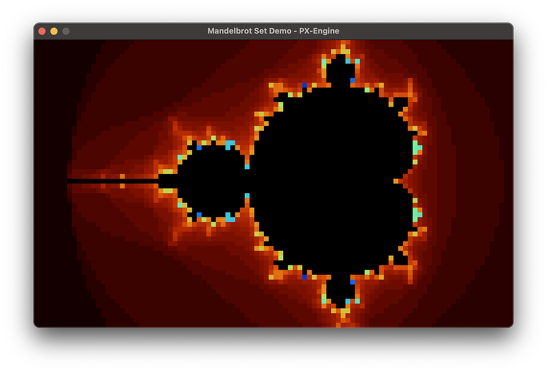

# PX-Engine

## Overview
PX-Engine is a lightweight C++ 20 engine designed for **direct pixel manipulation**. It provides a minimalistic API, enabling developers to create pixel-based applications without dealing with low-level graphics complexities.

> **Note:** This project is in **active development**, and the API may change over time. Expect updates and improvements in future releases.

## Features

- **Pixel-Level Drawing:** Easily draw individual pixels with simple API calls.
- **Modern C++20 Design:** Uses modern C++20 features for efficiency and readability.
- **Cross-Platform Support:** Works on **Windows**, **macOS**, and **Linux**.
- **Pixel Scaling:** Supports rendering at lower resolutions with larger pixel sizes for a retro look.
- **Minimal API:** A straightforward interface—just inherit from `Engine` and start drawing.



## Getting Started

### Requirements

To build and use PX-Engine, ensure you have:

- **C++ Compiler:** A C++20-compliant compiler (e.g., GCC 10+, Clang 10+, MSVC 2019+).
- **CMake:** Version **3.30+** (used for project configuration).
- **Python:** Required for dependency management.
- **Git:** Needed to clone the repository and fetch dependencies.

### Building the Project

1. **Clone the repository:**
    ```bash
    git clone https://github.com/angelotadres/px-engine.git
    cd px-engine
    ```
2. **Configure the project with CMake:**
    ```bash
    mkdir build && cd build
    cmake ..
    ```
3. **Build the engine:**
    ```bash
    cmake --build .
    ```

### Running the Examples

PX-Engine comes with two example applications:

#### Rotating Square Demo

Demonstrates basic transformations and input handling:

```bash
./px-engine-square
```

**Features:**
- Uses Bresenham’s line algorithm to draw lines.
- Applies 2D transformations using GLM.

**Controls:**
- Press `SPACE` to change the square's color.

#### Mandelbrot Set Visualization Demo

Illustrates pixel-based fractal rendering:

```bash
./px-engine-mandelbrot
```

**Features:**
- Generates a Mandelbrot set visualization.
- Maps pixels to the complex plane.
- Interactive pan and zoom controls.

**Controls:**
- Use `W/A/S/D` to move (pan) the view.
- Use `UP` and `DOWN` arrows to zoom in and out.

## Using PX-Engine in Your Project

1. **Include the Engine API**
    ```cpp
    #include "engine.h"
    ```
2. **Inherit from the `Engine` Class**
    ```cpp
    class MyPixelApp : public Engine {
    public:
        MyPixelApp(int width, int height, const std::string &title, int pixelSize = 1)
            : Engine(width, height, title, pixelSize) {}

        void onSetup() override {
            // Initialization code
        }

        void onUpdate(float deltaTime) override {
            drawPixel(getWidth() / 2, getHeight() / 2, Color::White);
        }
    };

    int main() {
        MyPixelApp app(160, 120, "Low Res Game", 4);
        app.run();
        return 0;
    }
    ```

3. **Link Against the Library (CMake Example)**
    ```cmake
    cmake_minimum_required(VERSION 3.30)
    project(MyPixelProject)

    set(CMAKE_CXX_STANDARD 20)

    add_subdirectory(px-engine)

    add_executable(my_app main.cpp)
    target_link_libraries(my_app PRIVATE px-engine)
    ```

## API Overview

### Main Engine Class (`engine.h`)

- `void run();` → Starts the main loop.
- `void drawPixel(int x, int y, Color color);` → Draws a pixel at `(x, y)`.
- `void drawLine(int x1, int y1, int x2, int y2, Color color);` → Draws a line from `(x1, y1)` to `(x2, y2)`.
- `bool isKeyPressed(KeyCode key) const;` → Checks if a key is pressed.
- `bool isMousePressed(MouseButton button) const;` → Checks if a mouse button is pressed.
- `std::pair<double, double> getMousePosition() const;` → Gets the current mouse cursor position.
- `int getWindowWidth() const;` → Returns the window width in pixels.
- `int getWindowHeight() const;` → Returns the window height in pixels.
- `int getWidth() const;` → Returns the logical surface width.
- `int getHeight() const;` → Returns the logical surface height.
- `int getPixelSize() const;` → Returns the pixel size scaling factor.

### Colors (`color.h`)

- **Predefined Colors:** `Color::White`, `Color::Black`, `Color::Red`, etc.
- **Custom Colors:** `Color myColor(255, 128, 0);` (orange)

### Input Codes (`keyCodes.h`)

Check for key presses using the `KeyCode` enum, which maps directly to GLFW key codes:

```cpp
if (isKeyPressed(KeyCode::W)) {
    // Move up
}
```

## License

PX-Engine is licensed under the **Apache 2.0 License**. See [LICENSE](LICENSE) for details.